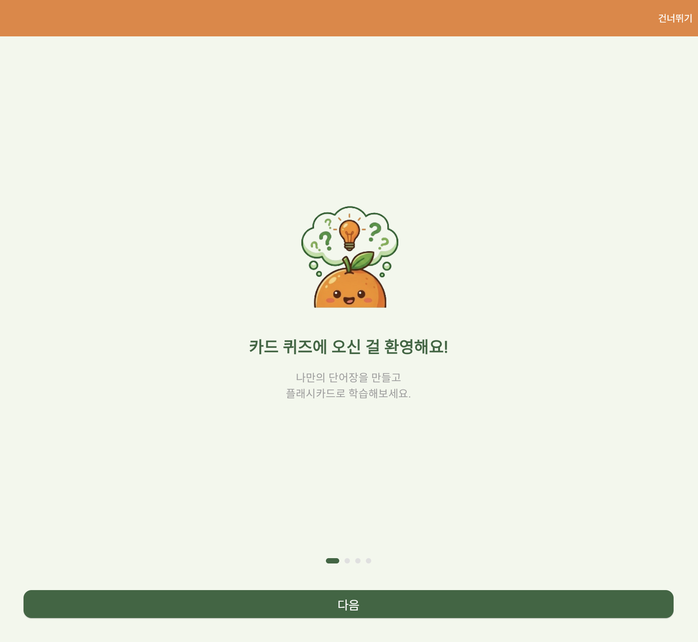
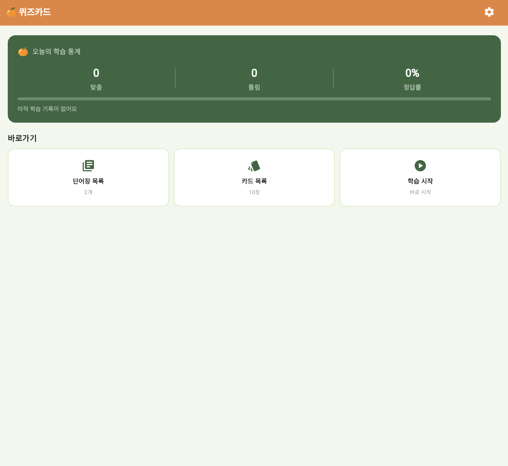
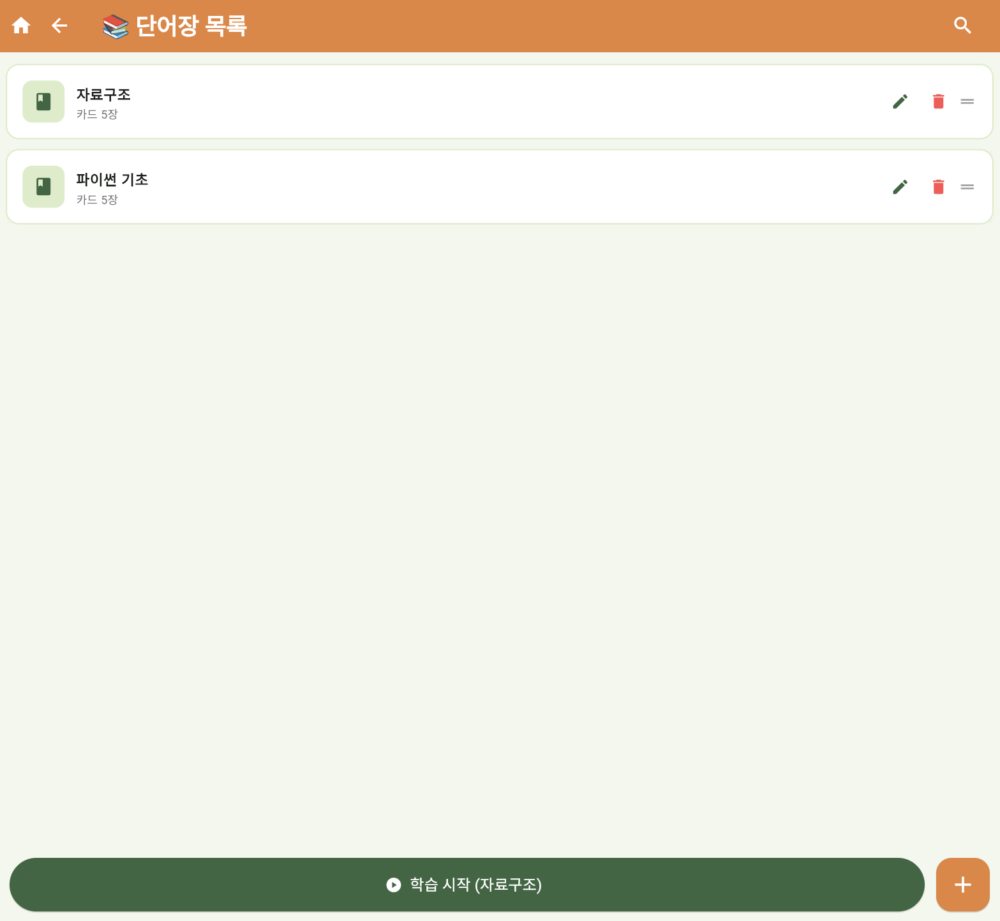
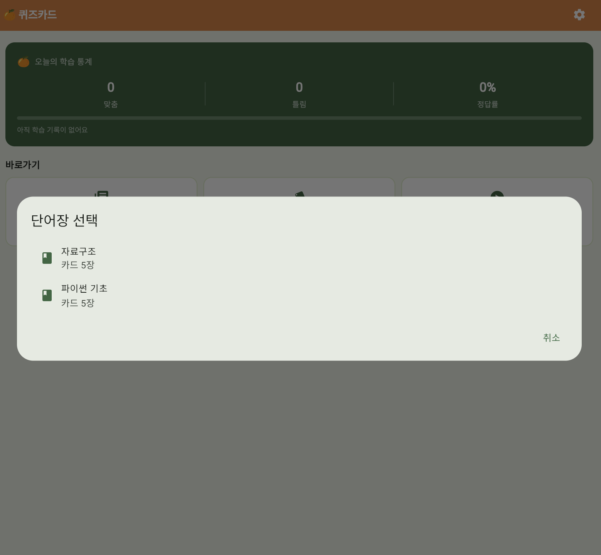
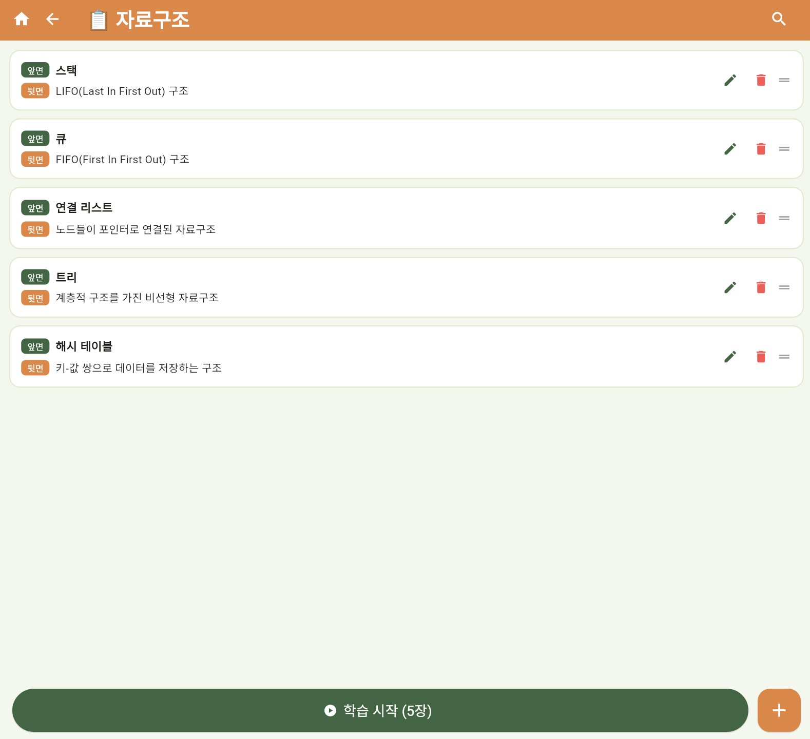
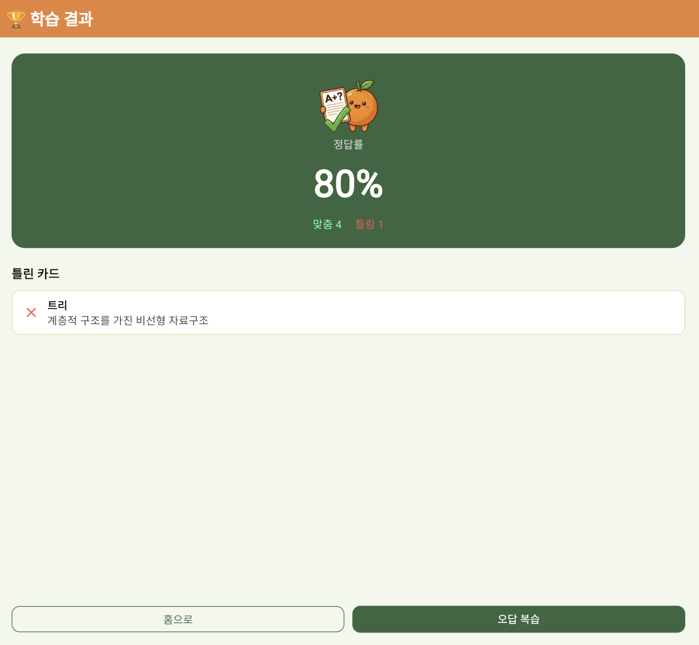
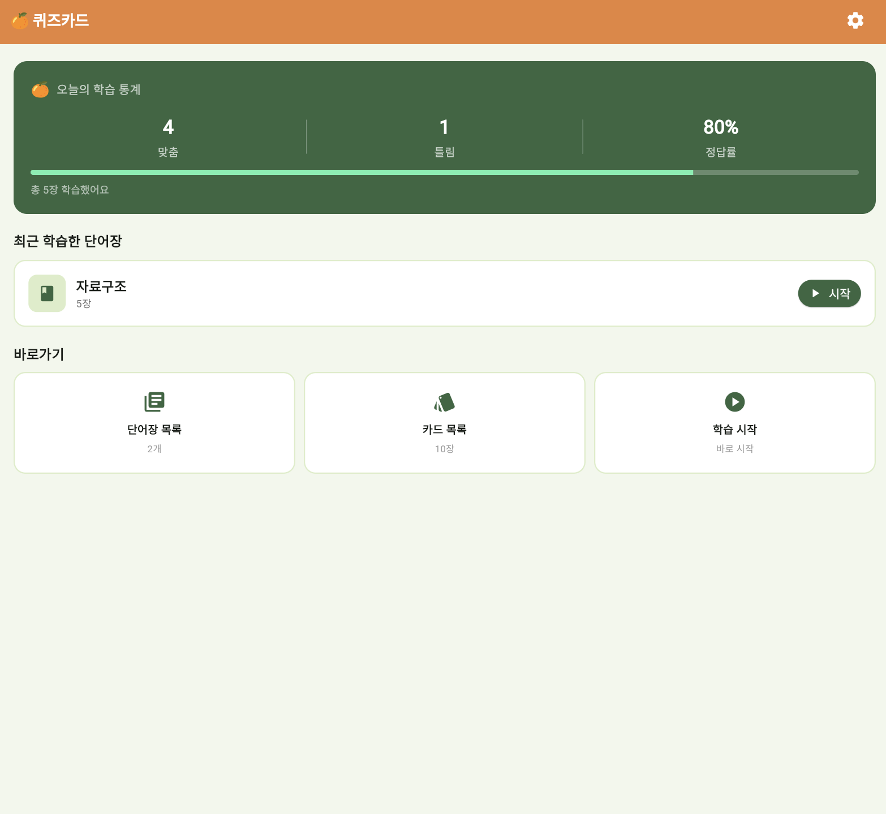
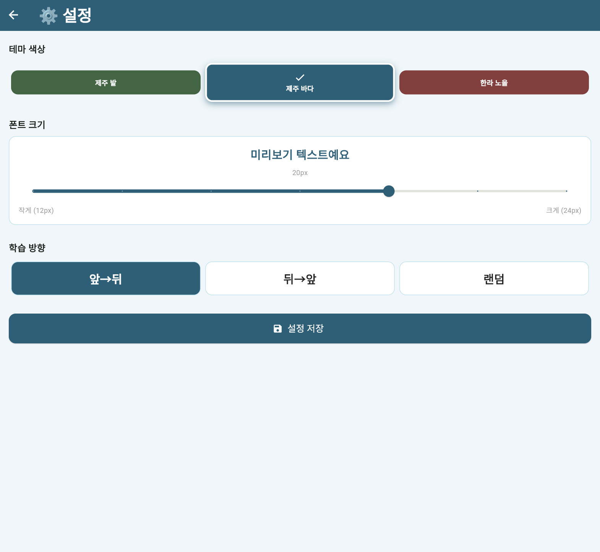

# 🍊 Card Quiz
> 나만의 단어장을 만들고 플래시카드로 학습하는 Flutter 웹 앱


---

## 📌 소개

Flutter와 Dart를 사용하여 만든 **플래시카드 학습 앱**입니다.  
나만의 단어장을 만들고 카드 뒤집기 방식으로 학습할 수 있으며,  
테마 색상과 폰트 크기를 취향에 맞게 설정할 수 있습니다.

---

## 💡 프로젝트 목적

라인편집기(Line Editor) 개념을 응용한 실습 프로젝트입니다.  
라인편집기의 핵심 기능인 **추가 / 삭제 / 수정 / 순서 변경 / 저장 / 불러오기**를 단어장 앱에 적용했습니다.

| 라인편집기 기능 | 앱 적용 |
|---|---|
| `insert()` — 삽입 | 단어장 / 카드 추가 |
| `delete()` — 삭제 | 단어장 / 카드 삭제 |
| `replace()` — 수정 | 단어장 / 카드 수정 |
| `print_all()` — 출력 | 목록 화면 표시 |
| `save()` — 저장 | SharedPreferences 저장 |
| `load()` — 불러오기 | 앱 실행 시 데이터 불러오기 |
| 순서 변경 (확장) | 드래그로 순서 변경 |

---

## 📷 실행 화면

| 온보딩 | 홈 화면 | 단어장 목록 |
|-----------|-----------|-----------|
|  |  |  |

| 단어장 선택 | 카드 목록 | 결과 화면 |
|-----------|-----------|-----------|
|  |  |  |

 | 학습 후 홈 화면 | 설정 화면 |
|-----------|-----------|
|  |  |

---

## ✨ 주요 기능

- 📚 **단어장 관리** — 단어장 추가 / 수정 / 삭제 / 드래그 순서 변경
- 🃏 **카드 관리** — 카드 추가 / 수정 / 삭제 / 드래그 순서 변경
- 🔍 **검색** — 단어장 및 카드 검색
- 🎴 **카드 뒤집기 학습** — 탭으로 앞/뒤 전환, 맞춤/틀림 체크
- ✅ **오답 복습** — 틀린 카드만 모아 다시 학습
- 🏆 **학습 결과** — 정답률 및 틀린 카드 목록 확인
- 🎨 **테마 3종** — 제주 밭 / 제주 바다 / 한라 노을
- 🔤 **폰트 크기 조절** — 설정에서 글자 크기 변경
- 🔀 **학습 방향** — 앞→뒤 / 뒤→앞 / 랜덤
- 🗺️ **온보딩** — 첫 실행 시 사용법 안내

---

## 🎮 사용법

### 단어장 만들기
```
홈 화면에서 단어장 목록 클릭
우측 하단 + 버튼 클릭
단어장 이름 입력 후 추가 클릭
```

### 카드 추가하기
```
단어장 목록에서 원하는 단어장 클릭
하단 + 버튼 클릭
앞면(질문/단어)과 뒷면(답/뜻) 입력 후 추가 클릭
```

### 학습하기
```
카드 목록 하단 학습 시작 버튼 클릭
카드를 탭해서 뒤집기
맞으면 맞춤, 틀리면 틀림 버튼 클릭
```

### 결과 확인하기
```
학습 완료 후 정답률 확인
틀린 카드 목록 확인
오답 복습으로 틀린 카드만 다시 학습
```

### 설정
```
홈 화면 우측 상단 ⚙️ 버튼 클릭
테마 색상 / 폰트 크기 / 학습 방향 변경
설정 저장 버튼 클릭
```

---

## 🗂️ 파일 구조

```
card_quiz/
├── lib/
│   ├── main.dart
│   ├── theme/
│   │   └── colors.dart
│   ├── models/
│   │   ├── card_item.dart
│   │   ├── deck.dart
│   │   └── today_stats.dart
│   ├── services/
│   │   ├── storage_service.dart
│   │   └── app_settings.dart
│   └── screens/
│       ├── home_screen.dart
│       ├── deck_list_screen.dart
│       ├── card_list_screen.dart
│       ├── study_screen.dart
│       ├── result_screen.dart
│       ├── settings_screen.dart
│       └── onboarding_screen.dart
├── assets/
│   └── images/
└── pubspec.yaml
```

---

## 🚀 배포 링크

🔗 [카드 퀴즈 바로가기](#) <!-- 배포 후 링크 추가 -->

---

## 🛠️ 기술 스택

- **Language** — Dart
- **UI Framework** — Flutter
- **State Management** — Provider
- **Local Storage** — SharedPreferences

---

## 👩‍💻 개발자

- GitHub: [@Jenny5789](https://github.com/Jenny5789)
